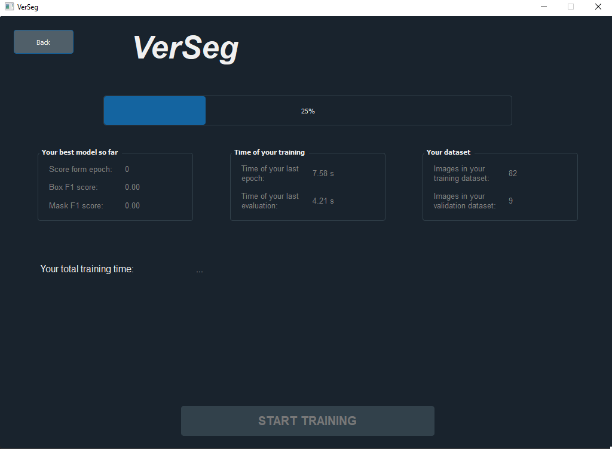
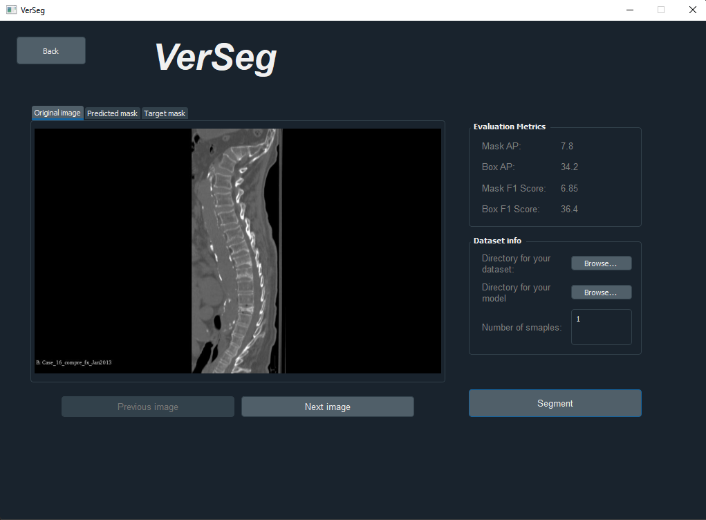
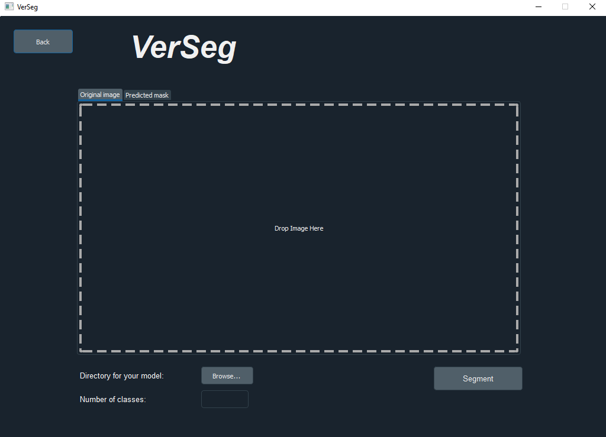

# VerSeg

VerSeg is a solution that implements the lightweight architecture of the Mask R-CNN network - instance segmentation algorithm. The algorithm was used on the problem of vertebral segmentation in CT images. Application, apart from the implementation of Mask R-CNN, has a window interface that allows both training, evaluation and inference on unlabeld data.

## Tech stack

- Python
- Pytorch
- PyQt

## Installation

Use pip to install VerSeg.

```bash
pip install -r requirements.txt
```

## Usage

To run the window application, just enter the following in the terminal with the running environment:

```bash
python3 main_window.py
```

## Interface


<br>


<br>


<br>